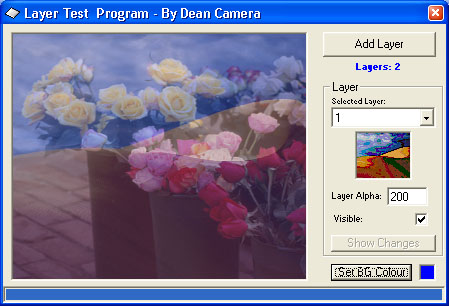



## PhotoShop\-Like Layers Demo \(UPDATED\)

### Description

This is a small demonstration showing you how to implement dynamic Photoshop-like graphics layers in VB (including alpha-blending). By this, I mean this demo shows you how to create code that will enable you to add, manipulate and move each individual layer at runtime while using a small amount of memory for each layer.

This sample uses intermediate code; i.e. no subclassing etc., only GDI API functions.

Please see the comments on the demo form for a longer explanation. Votes welcome, comments preferred. UPDATE: Major GDI memory leaks fixed, support for Win98, Layer Delete button and Percentage Alpha values added.
 
### More Info
 

             |
---                |---
**Submitted On**   |2005-05-26 07:49:16
**By**             |[Dean Camera](https://github.com/Planet-Source-Code/PSCIndex/blob/master/ByAuthor/dean-camera.md)
**Level**          |Intermediate
**User Rating**    |4.9 (93 globes from 19 users)
**Compatibility**  |VB 6\.0
**Category**       |[Graphics](https://github.com/Planet-Source-Code/PSCIndex/blob/master/ByCategory/graphics__1-46.md)
**World**          |[Visual Basic](https://github.com/Planet-Source-Code/PSCIndex/blob/master/ByWorld/visual-basic.md)
**Archive File**   |[PhotoShop\-1892775262005\.zip](https://github.com/Planet-Source-Code/dean-camera-photoshop-like-layers-demo-updated__1-60654/archive/master.zip)

